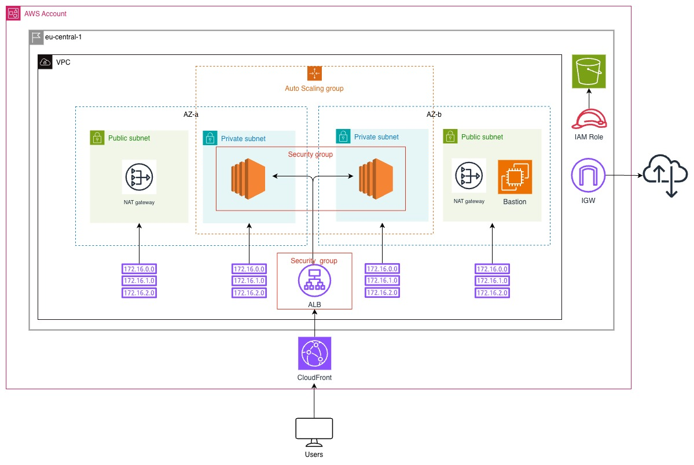

# AWS CloudFormation High Availability Web App

This project provisions a highly available web application infrastructure on AWS using CloudFormation.

## Architecture Diagram



Diagram source file: `HA-daigram.jpg`

## Prerequisites

1. AWS CLI installed and configured.
2. Permissions to create CloudFormation, IAM, VPC, EC2, ALB, Auto Scaling, and S3 resources.
3. Bash shell (macOS/Linux).
4. `jq` installed (used by the `deploy` action in `run-script.sh`).

## Project Files

- Network template: `network-infra/network.yaml`
- Network parameters: `network-infra/network-pram.json`
- App template: `app-infra/app.yaml`
- App parameters: `app-infra/app-pram.json`
- Script: `run-script.sh`

## Create Infrastructure

Create stacks in this order: network first, then app.

```bash
./run-script.sh create network-stack ./network-infra/network.yaml ./network-infra/network-pram.json
./run-script.sh create app-stack ./app-infra/app.yaml ./app-infra/app-pram.json
```

If stacks already exist, update them:

```bash
./run-script.sh update network-stack ./network-infra/network.yaml ./network-infra/network-pram.json
./run-script.sh update app-stack ./app-infra/app.yaml ./app-infra/app-pram.json
```

## Delete Infrastructure

Delete stacks in reverse order: app first, then network.

```bash
./run-script.sh delete app-stack ./app-infra/app.yaml ./app-infra/app-pram.json
./run-script.sh delete network-stack ./network-infra/network.yaml ./network-infra/network-pram.json
```

## Evidence of Work

### Working URL

Application URL:

http://dev-app-alb-244429590.eu-central-1.elb.amazonaws.com/

Observed response:

`Udacity Demo Web Server Up and Running!`

This confirms the load balancer endpoint is reachable and serving application content.
